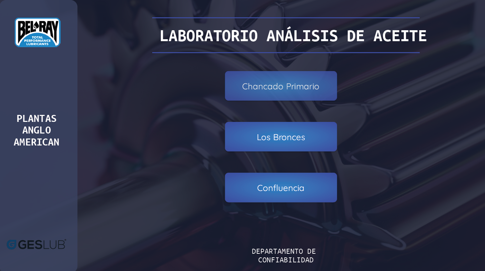

# Dashboard Bitácora de Análisis de Aceite

📊 Proyecto BI para visualizar resultados de análisis de aceite de equipos industriales. Permite hacer seguimiento de tendencias, alertas y condiciones críticas para mantenimiento predictivo.

## 🔧 Herramientas
- Power BI
- Google Sheets
- Apps Script
- BigQuery

## 📸 Capturas del Dashboard

### Página principal

### Aplicaciones

### Equipos

### Salud del equipo

### Desgaste

### Contaminantes

---

## 🔐 Notas
Las imágenes han sido modificadas o anonimizadas con fines demostrativos. Este proyecto está protegido por licencia CC BY-NC-ND.

