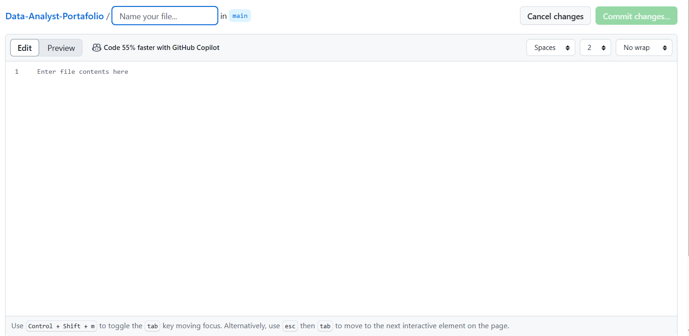

# Data-Analyst-Portafolio
BI Projects and Industrial Data Analysis - Joaquin Sepulveda
> ⚠️ Este proyecto es parte de mi portafolio personal y se encuentra protegido bajo una licencia CC BY-NC-ND. No está permitido su uso comercial ni su modificación.

# Portafolio Data Analyst - Joaquín Sepúlveda

Bienvenido a mi portafolio de proyectos como Data Analyst, donde combino mi background en ingeniería industrial y experiencia en operaciones mineras con el poder del análisis de datos y la inteligencia de negocios.

## 🔍 Proyectos Destacados

### 🟢 [Dashboard de Lubricadores](./lubricadores-dashboard)

Visualización crítica en Looker Studio para monitorear el estado de lubricadores automáticos.  
Tecnologías: Looker Studio, Google Sheets, BigQuery, IoT, Apps Script.

### 🟠 [Asistencia Técnica con NFC](./asistencia-nfc)
Sistema de registro de asistencia en terreno utilizando llaveros NFC y Google Sheets.  
Tecnologías: MacroDroid, Apps Script, Google Sheets, sensores NFC.

### 🔵 [ETL y Análisis de Consumo Bicing](./etl-bicing)
Proceso de extracción, transformación y carga de datos sobre usuarios y consumo en Barcelona.  
Tecnologías: Python, Pandas, Power BI, Google Data Studio.

---

## 👨‍💻 Sobre mí
Ingeniero Civil Industrial especializado en Business Intelligence, con experiencia en automatización, mantenimiento predictivo y proyectos de trazabilidad para operaciones en terreno.

📍 Basado en Barcelona | 🌍 Disponible para roles remotos o híbridos en Europa.

🔗 [LinkedIn](https://www.linkedin.com/in/joaquinsepulvedaa)

---

> ⚠️ Todos los proyectos aquí presentes están protegidos bajo licencia CC BY-NC-ND. Son solo para fines demostrativos.

