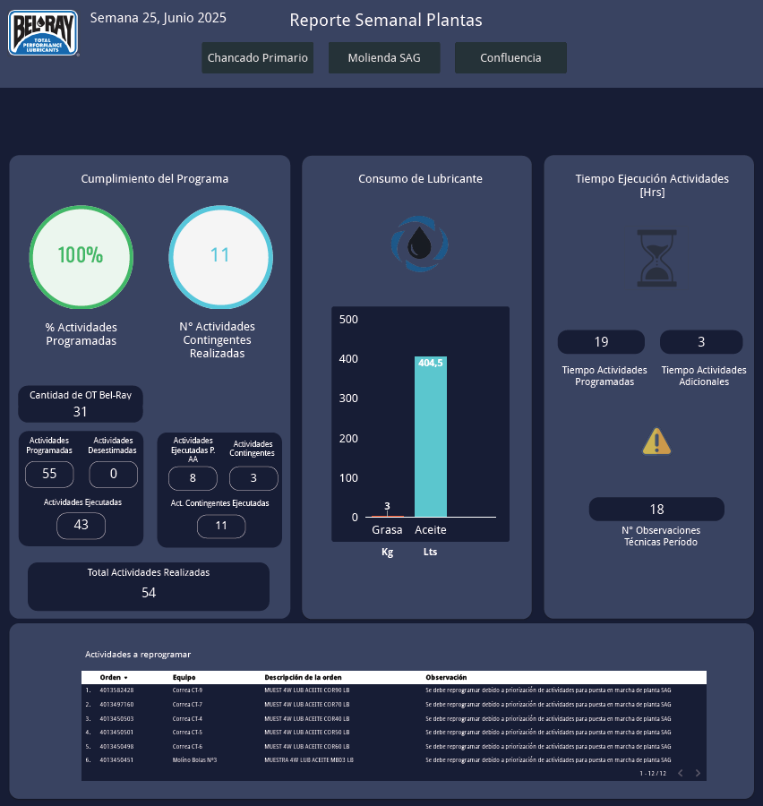
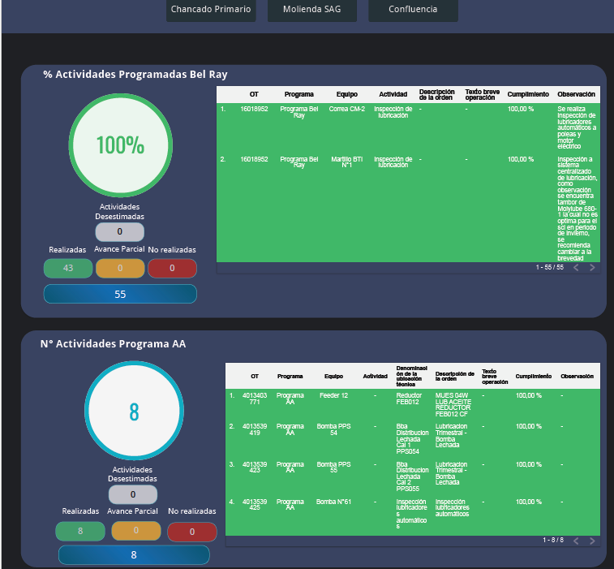

# Servicio de Lubricación Industrial - Faena Minera

🛢️ Proyecto integral de planificación, trazabilidad y control de tareas de lubricación en terreno. Este servicio se diseñó para asegurar los cumplimientos de los programas, verificar los consumos y tiempos especificos de cada tarea y para alertar sobre posibles desviaciones en el servicio

## 🎯 Objetivo
Asegurar la ejecución eficiente de los planes de lubricación, con trazabilidad por equipo, componente y tipo de lubricante. El sistema permite controlar cumplimiento, detectar desviaciones y documentar mejoras continuas.

## 📋 Alcance del Servicio
- Planificación y calendarización de tareas según criticidad del equipo
- Asignación de rutas de lubricación por operario y zona
- Registro en terreno mediante formularios digitales (Plataforma Interna)
- Validación y control por supervisión técnica
- Reportes automáticos semanales para cliente (dashboards Looker Studio)

## 🧰 Herramientas utilizadas
- Programa de mantenimiento interno para el registro de ejecución de tareas
- Vista en Bigquery para conectarse a esos datos
- Looker Studio para visualización de cumplimiento y hallazgos

## 📈 Resultados alcanzados
- Trazabilidad del 100% de las tareas realizadas y no realizadas
- Reducción de tiempo para la creación de los reportes semanales
- Mejora en el tiempo de respuesta ante hallazgos detectados en terreno
- Cierre de programa de manera agil y con respaldos fotográficos de las tareas críticas

## 📸 Visuales disponibles
_

